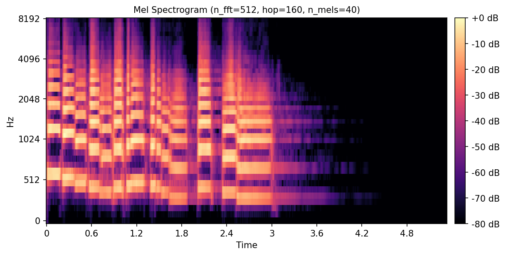

# RVV Mel Spectrogram


An audio front end (**FFT → power spectrum → mel filter bank**) vectorised by hand with
**RISC-V Vector Extension (RVV 1.0) intrinsics**. It is benchmarked on the Spike simulator using
hardware cycle counters (`Zicntr`) and checked against a Python/librosa reference.

<p align="center">
  
  <br>
  <sub>Mel spectrogram of librosa's <code>trumpet</code> example (n_fft 512, hop 160, 40 mel bands),
  an illustration supplied with the assignment. The <code>melspec_trumpet</code> benchmark runs my
  kernels on the first second of this clip and compares the result with the expected output stored
  in <code>data/mel_spectrogram.txt</code>.</sub>
</p>

> Lab 2 of my *Computer Organization* coursework (NCKU CSIE, Spring 2026).
> See the [full lab series](#lab-series) below.

## Highlights

- **Radix-2 Cooley–Tukey FFT** with vectorised butterflies. Each stage handles the whole
  independent half-block in one strip-mined vector loop, and complex multiplication is fused
  (`vfmul` + `vfnmsac` / `vfmacc`).
- **Power spectrum** with a *strided load* (`vlse32`, stride 8 bytes). The interleaved `re, im`
  pairs are split into two vector registers in one pass, and `re² + im²` is fused with `vfmacc`.
- **Mel filter bank** as a mat-vec product with **4-row register blocking**. Each power-spectrum
  chunk is loaded once and reused for four mel filters before being reduced with `vfredusum`.
- **Vector-length-agnostic** code throughout. Every loop is strip-mined with `vsetvl`, so the
  same binary is correct for any hardware `VLEN`.

## The pipeline

```
audio ─► Hann window ─► STFT (framing + fft) ─► power_spectrum ─► mel_filter_bank ─► mel spectrogram
                               ▲                     ▲                    ▲
                        implemented here      implemented here     implemented here
```

| Constant | Value | Meaning |
|----------|-------|---------|
| `N_FFT` | 512 | FFT frame size |
| `HOP_LENGTH` | 160 | Samples between frames (16 kHz audio → 10 ms hop) |
| `N_FREQ_BINS` | 257 | `N_FFT / 2 + 1` |
| `N_MELS` | 40 | Mel bands |
| `MAX_FFT_N` | 4096 | Largest FFT the kernel must support |

## Implementation notes

All three kernels live in [`src/main.c`](src/main.c).

### `fft(real, imag, n)`

1. **Bit-reversal permutation**, done in place with the incremental reversed-counter trick
   (`j ^= bit`). This is O(n) with no lookup table.
2. **log₂ n butterfly stages.** For each stage length `len`, the twiddle factors
   `W = e^{-2πik/len}` are precomputed into a table. The butterflies over `k ∈ [0, len/2)` are then
   processed `vl` at a time with `LMUL = 8` vector groups:

   ```
   t   = v · W            (vfmul + vfnmsac for Re, vfmul + vfmacc for Im)
   u'  = u + t
   v'  = u − t
   ```

### `power_spectrum(stft, frames, out)`

The whole `frames × 257` complex array is treated as one flat stream. Two strided loads
(`vlse32`, byte stride 8) pull out all real and all imaginary parts. The result is then
`re*re` followed by `vfmacc(im, im)`. There is a single loop and no gather/shuffle.

### `mel_filter_bank(power, bank, frames, mels, bins, out)`

Each output is the dot product `out[f][m] = Σ_k power[f][k] · bank[m][k]`. Four mel rows are
processed together, so every `power[f][k..k+vl]` load is shared by four multiply–reduce chains.
This cuts memory traffic on the power spectrum by 4×. A scalar-row tail loop handles
`n_mels % 4`.

## Repository layout

```
.
├── src/
│   ├── main.c              # ★ my RVV implementation (fft, power_spectrum, mel_filter_bank)
│   ├── utils.c             # provided: hann_window, stft, melspectrogram pipeline
│   └── bench.c             # provided: correctness + cycle benchmark harness
├── include/mel_spectrogram.h
├── scripts/                # Python ground truth (librosa) and scoring script
├── data/                   # reference inputs and expected outputs
├── assets/                 # provided: spectrogram illustration
├── Makefile
└── pyproject.toml / uv.lock
```

## Build and run

Requirements: the RISC-V GNU toolchain, Spike, `pk` and [`uv`](https://docs.astral.sh/uv/).
All of them are preinstalled in the course image:

```bash
docker run -it --rm -v "$(pwd)":/workspace -w /workspace docker.io/asrlab/comp-org:pa2
```

```bash
make compile   # riscv64-unknown-linux-gnu-gcc -O3 -fno-tree-vectorize -march=rv64gcv ...
make run       # runs build/bench on Spike (RV64GCV_Zicntr), writes output/results.csv
make judge     # compile + run + score correctness and speed-up vs. the scalar baseline
```

`-fno-tree-vectorize` turns off the compiler's auto-vectoriser, so every speed-up comes from the
hand-written intrinsics.

## What I'd improve next

- **Register pressure in `mel_filter_bank`.** With `LMUL = 8` there are only four vector register
  groups, but the 4-row block keeps five live (`power` + 4 rows), which forces spills. Using
  `LMUL = 4` or `LMUL = 2` would avoid them.
- **Accumulate, then reduce once.** Keeping a vector accumulator with `vfmacc` and calling
  `vfredusum` once per dot product (instead of once per strip) would take the reduction off the
  inner loop.
- **Twiddle factors.** Computing them once for the largest stage and indexing with a stride
  (`W_len^k = W_N^{k·N/len}`) would remove the per-stage `sin`/`cos` calls.

## Lab series

| Lab | Repository | Topic |
|-----|------------|-------|
| 1 | [riscv-inline-asm-algorithms](https://github.com/Adam010341/riscv-inline-asm-algorithms) | RV64IF inline assembly |
| 2 | **rvv-mel-spectrogram** (this repo) | RISC-V Vector (RVV) intrinsics, FFT, DSP |
| 3 | [cache-aware-riscv-optimization](https://github.com/Adam010341/cache-aware-riscv-optimization) | Tree-PLRU cache simulator, cache-blocked transpose, RVV GEMM |

---

<sub>The benchmark harness, pipeline glue (`utils.c`, `bench.c`), Python reference, data and the
spectrogram image in `assets/` were provided by the course staff. The three kernels in
`src/main.c` are my own work.</sub>
