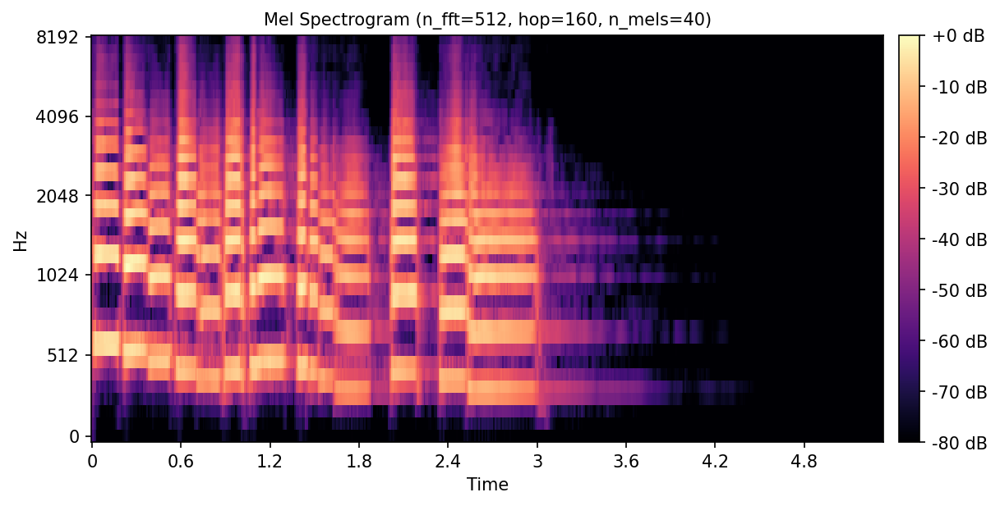

# RVV Mel Spectrogram


An audio front end (FFT, power spectrum, mel filter bank) that I vectorised by hand with RISC-V
Vector Extension (RVV 1.0) intrinsics. It is benchmarked on the Spike simulator with the `cycle` counter
(`rdcycle`, `Zicntr`) and checked against the course's NumPy reference,
[`scripts/mel_spectrogram.py`](scripts/mel_spectrogram.py).

<p align="center">
  
  <br>
  <sub>Mel spectrogram of librosa's <code>trumpet</code> example (n_fft 512, hop 160, 40 mel bands),
  supplied with the assignment. The <code>melspec_trumpet</code> benchmark runs the kernels on the
  first second of this clip and compares against <code>data/mel_spectrogram.txt</code>.</sub>
</p>

> Lab 2 of NCKU Computer Organization (CSIE, Spring 2026). See the [lab series](#lab-series) below.

## Kernels

All three are in [`src/main.c`](src/main.c).

`fft` is a radix-2 Cooley-Tukey. Bit-reversal is in place with a reversed counter (`j ^= bit`).
Then log2 n butterfly stages, with twiddle factors precomputed per stage. Butterflies run `vl` at
a time with `LMUL = 8`, and the complex multiply is `vfmul` + `vfnmsac` / `vfmacc`.

`power_spectrum` uses two strided loads (`vlse32`, stride 8 bytes) to split the interleaved
`re, im` pairs, then `re*re` and `vfmacc(im, im)`. One loop over the flat `frames x 257` array.

`mel_filter_bank` computes `out[f][m] = sum_k power[f][k] * bank[m][k]`. I process four mel rows at
once so each power-spectrum load is reused four times, then reduce with `vfredusum`. A scalar tail
handles `n_mels % 4`.

All vector loops are strip-mined with `vsetvl`, so nothing depends on `VLEN`.

| Constant | Value | Meaning |
|----------|-------|---------|
| `N_FFT` | 512 | FFT frame size |
| `HOP_LENGTH` | 160 | Samples between frames (16 kHz audio, 10 ms hop) |
| `N_FREQ_BINS` | 257 | `N_FFT / 2 + 1` |
| `N_MELS` | 40 | Mel bands |
| `MAX_FFT_N` | 4096 | Largest FFT the kernel must support |

## Layout

```
src/main.c              my RVV implementation (fft, power_spectrum, mel_filter_bank)
src/utils.c             provided: hann_window, stft, melspectrogram pipeline
src/bench.c             provided: correctness + cycle benchmark harness
include/mel_spectrogram.h
scripts/                NumPy ground truth, librosa cross-check, scoring script
data/                   reference inputs and expected outputs
assets/                 provided: spectrogram illustration
Makefile, pyproject.toml, uv.lock
```

## Build and run

Needs the RISC-V GNU toolchain, Spike, `pk` and [`uv`](https://docs.astral.sh/uv/), all preinstalled
in the course image:

```bash
docker run -it --rm -v "$(pwd)":/workspace -w /workspace docker.io/asrlab/comp-org:pa2
```

```bash
make compile   # riscv64-unknown-linux-gnu-gcc -O3 -fno-tree-vectorize -march=rv64gcv ...
make run       # runs build/bench on Spike (RV64GCV_Zicntr), writes output/results.csv
make judge     # compile + run + score correctness and speed-up vs. the scalar baseline
```

`-fno-tree-vectorize` turns off auto-vectorisation, so the speed-up is from the intrinsics.

## Not done yet

- `mel_filter_bank` at `LMUL = 8` has only four register groups, but the 4-row block loads five
  values (`power` + 4 rows) before using them. A smaller `LMUL` should fix that.
- Keep a `vfmacc` accumulator and call `vfredusum` once per dot product instead of once per strip.
- Compute twiddle factors once for the largest stage and index with a stride
  (`W_len^k = W_N^{k·N/len}`) to drop the per-stage `sin`/`cos` calls.

## Lab series

| Lab | Repository | Topic |
|-----|------------|-------|
| 1 | [riscv-inline-asm-algorithms](https://github.com/Adam010341/riscv-inline-asm-algorithms) | RV64IF inline assembly |
| 2 | **rvv-mel-spectrogram** (this repo) | RISC-V Vector (RVV) intrinsics, FFT, DSP |
| 3 | [cache-aware-riscv-optimization](https://github.com/Adam010341/cache-aware-riscv-optimization) | Tree-PLRU cache simulator, cache-blocked transpose, RVV GEMM |

---

<sub>The benchmark harness, pipeline glue (`utils.c`, `bench.c`), Python reference, data and the
spectrogram image in `assets/` were provided by the course staff. The three kernels in
`src/main.c` are my own work.</sub>
